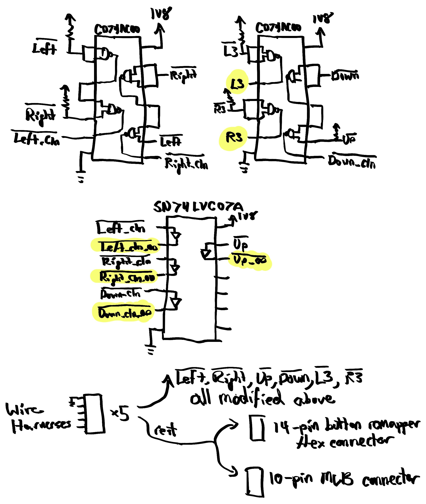

A
[leverless (or stickless) controller](https://glossary.infil.net/?t=Leverless)
is a type of arcade controller that uses buttons for movement controls instead
of an arcade stick. One popular example is the
[Hit Box](https://www.hitboxarcade.com/products/hit-box).
I recently created a custom leverless controller using the electronics from
Playstation 5's DualSense controller, an enclosure purchased from
[Eternal Rival](https://www.eternalrival.com),
and various other components.  The practice of utilizing an existing game
controller's electronics in a custom arcade controller is commonly referred to
as "padhacking".  Here, I document the parts I used and steps I took to
complete this project.

<!--break-->

[[toc]]

## Goals

The practice of building custom arcade controllers (leverless or otherwise) is
quite common and there are a wide variety of controller boards available that
are paired with pseudo-standard wiring harnesses for connecting to the buttons.
I instead opted to use the DualSense electronics in order to gain the option
for wireless functionality when I desire it and for excellent compatibility
with many hosts (PS5, computers, iOS devices, etc.).  For this project, I had a
few goals in mind:

* **Goal 1:** The implementation should be modular.  No two boards should be
  connected together via soldered wires.

* **Goal 2:** Reworks to the DualSense MLB should be as minimal as possible.

* **Goal 3:** All of the existing DualSense controller functionality should be
  preserved except for LED indicators, the touchpad surface, the microphones &
  speaker, the rumble motors, and the adaptive triggers.  All physical buttons
  should be made available on the controller.  Both the USB-C and audio ports
  should be made available.

## Design

There are 8 fundamental components in this project:

1.  The enclosure

2.  The 19 arcade buttons (12 24mm buttons and 1 30mm button on the top, and 2
    24mm buttons each on the north, east, and west sides)

3.  The controller board: a protoboard that receives all of the button signals
    and maps them to the DualSense's inputs (performing some signal
    modification as necessary, discussed below)

4.  The 5 wiring harnesses which connect the buttons to the controller board

5.  The reworked DualSense MLB and its satellite parts (adaptive trigger
    boards, touchpad board, button flex breakout flex+board, and battery)

6.  The 2 ribbon cables which connect the controller board to the DualSense MLB

7.  The USB-C passthrough cable

8.  The audio jack passthrough cable

## Bill of Materials

As this was the first time I've built a device like this, I ordered more than I
needed.  However, for this list, I've tried to include only the things that are
necessary (with a couple of hacks that could be cleaned up as noted by
asterisks and discussed in the following sections).  In some cases, I may have
had parts already, so I linked the closest thing that I think _should_ work.

* Enclosure: Eternal Rival's
  [Mid-Tier Stickless Mini](https://www.eternalrival.com/products/eternal-rival-stickless-mini)

* Buttons

    * 12× [24mm buttons](https://www.arcaderenovations.com/samducksa-screw-in-button-black-SBD-202-24mm-Cherry.html)
      for the top — after some research, I decided to use Samducksa Crown SDB-202

    * 1× [30mm button](https://www.arcaderenovations.com/samducksa-screw-in-button-black-SBD-202-30mm-Cherry.html)

    * 6× [24mm snap-in buttons](https://www.arcaderenovations.com/sanwa-snap-in-button-black-OBSF-24-K.html)
      for the sides (sidewalls of this enclosure are incompatible with screw-in buttons)

* [DualSense Controller](https://www.playstation.com/en-us/accessories/dualsense-wireless-controller/)

* Electronics Parts

    * 1× [DualSense button remap flex for BDM-030/BDM-040 MLBs](https://consolecustoms.com/ps5-easy-mapper-v3-0-fixed-button-mapping-flex-mod-for-bdm-030-bdm-040/)

    * 5× [Brook hitbox wiring harnesses](https://www.amazon.com/dp/B083JW59Y3)*
    * 1× [14-position, 2-row, 0.1", 8" ribbon cable](https://www.digikey.com/en/products/detail/nkk-switches/ISDCB88/2187453)
    * 1× [10-position, 2-row, 0.1", 8" ribbon cable](https://www.digikey.com/en/products/detail/samtec-inc/IDSD-05-D-08-00-G/5055657)
    * 1× [USB-C passthrough cable](https://www.adafruit.com/product/4218)
    * 1× [Audio jack passthrough cable](https://www.adafruit.com/product/3319)
    * 1× [Protoboard kit](https://www.amazon.com/dp/B072Z7Y19F)
    * 30 [AWG Kynar-insulated wire](https://www.adafruit.com/product/4730)

* Electronics Components

    * 8× [10K resistors](https://www.digikey.com/en/products/detail/te-connectivity-passive-product/YR1B10KCC/2389737)
    * 3× [10µF capacitors](https://www.digikey.com/en/products/detail/kyocera-avx/TAP106K035CRW/3661000)
    * 3× [0.1µF capacitors](https://www.digikey.com/en/products/detail/vishay-beyschlag-draloric-bc-components/K104K10X7RF5UH5/2356754)
    * 2× [CD74AC00E Quad-NAND ICs](https://www.digikey.com/en/products/detail/texas-instruments/CD74AC00E/375682)
    * 1× [SN74LVC07ANSR Hex Open-Drain output buffer](https://www.digikey.com/en/products/detail/texas-instruments/SN74LVC07ANSR/1591727)
    * 1× [SOIC-14 to DIP-14 adapter](https://www.digikey.com/en/products/detail/chip-quik-inc/PA0004C/12352116)
    * 2× [14-position, 2-row, 0.1" pin header](https://www.digikey.com/en/products/detail/amphenol-cs-fci/67997-114HLF/2023288)
    * 1× [10-position, 2-row, 0.1" pin header (through-hole)](https://www.digikey.com/en/products/detail/amphenol-cs-fci/67997-410HLF/1878475)
    * 1× [10-position, 2-row, 0.1" pin header (surface-mount)](https://www.digikey.com/en/products/detail/molex/0015910100/614775)
    * 5× [5-position, 1-row, 0.1", right-angle receptacle headers](https://www.digikey.com/en/products/detail/sullins-connector-solutions/PPPC051LGBN-RC/775938)*
    * 5× [10-position, 2-row, 0.1", right-angle pin header](https://www.digikey.com/en/products/detail/phoenix-contact/1156939/15284555)*

* Mechanical Components & Adhesives

    * [1mm foam padding](https://www.amazon.com/dp/B0CR17P5BX)
    * [M2.5 nylon screw and standoff kit](https://www.digikey.com/en/products/detail/adafruit-industries-llc/3299/6596885)
    * [M2 nylon screw and standoff kit](https://www.amazon.com/dp/B07D78PFQL?psc=1&ref=ppx_yo2ov_dt_b_product_details)
    * [UV curing glue](https://www.amazon.com/dp/B0BQBQD4XB)
    * [Epoxy](https://www.amazon.com/dp/B001Z3C3AG)
    * [Double-sided tape](https://www.amazon.com/dp/B07VNSXY31)
    * [Kapton tape](https://www.amazon.com/dp/B072Z92QZ2)
    * [Wire ties](https://www.amazon.com/dp/B078NT5F2B)

* Tools

    * [Soldering iron](https://www.amazon.com/dp/B00ANZRT4M) with [angled tip](https://www.amazon.com/dp/B00762AGYU)
    * [Right angle tweezers](https://www.amazon.com/dp/B00FZPF6A4)
    * [Scalpel](https://www.amazon.com/dp/B07WTVF64Z)
    * [Flush cutters](https://www.amazon.com/dp/B00FZPDG1K)
    * [High-quality wire strippers](https://www.adafruit.com/product/527)
    * [Temperature-resistant workspace pad](https://www.amazon.com/dp/B08RXMDKWX?psc=1)
    * [Helping hands](https://www.amazon.com/dp/B000P42O3C)
    * [Magnifying glasses](https://www.amazon.com/dp/B0B7J9MDCL)
    * [Magnifying loupe](https://www.amazon.com/dp/B09N74X4YY)
    * [Fine solder wire](https://www.adafruit.com/product/1886)
    * [Solder wick](https://www.amazon.com/dp/B094GZ6CPZ)
    * [Solder flux](https://www.amazon.com/dp/B0CN29BZKV) (liquid worked well)
    * Drill with 5/64" and 7/64" drillbits (or 2mm and 2.5mm drillbits if you have access to metric drillbits), as well as a 1/4" drillbit
    * Dremel with cutting blade (for cutting PCBs)

## DualSense MLB Rework

I purchased a new DualSense controller (as opposed to a used one) for two
reasons:

1.  I wanted to ensure I received a controller with the latest board revision,
    BDM-040 (or at least BDM-030).  The trigger button architecture was
    simplified significantly in this revision, allowing the majority of the
    signals to be connected directly to the spot that the button flex usually
    attaches.

2.  I wanted to minimize the likelihood of having to debug a used controller,
    which might be damaged.

[This thread](https://acidmods.com/forum/index.php/topic,44714.0.html) on the
AcidMods forum provides a wealth of information about the DualSense controller.
I highly recommend reading through it in its entirety, but I will try to
extract all of the necessary pieces of information and include them in this
document.  Credit for most knowledge included here goes to this thread's
contributors, other than a few small bits I learned through measurement.

The BDM-030 and BDM-040 revisions include the following signals on the button
flex:

* Left, Right, Up, Down
* Square, X, Triangle, Circle
* L1, L2, R1, R2
* PS Button

Previous revisions inferred the value of L2 and R2 using the adaptive triggers'
feedback potentiometers.  It's certainly possible to build a controller using
this signal path, but I decided to take the easier route if I could.

The remaining buttons not on this flex (which I refer to as "non-flex buttons"
below) are:

* Share
* Option
* Mute
* Trackpad
* L3, R3
* The reset button on the back of the MLB

I decided on the following approach:

1.  Rather than solder jumper wires directly to the button flex connector area,
    press a button remapper flex against it and solder to the pads of that
    flex.  This minimized the number of destructive changes to the MLB.  I
    decided to mount that flex to a small PCB and solder the pads out to a
    14-pin connector, which I would then connect via ribbon cable to the
    controller board.

2.  For the remaining buttons (except for the reset button), use jumper wires
    to connect them to a 10-pin connector that I would glue onto the spot where
    the speaker previously sat.  I would then use a ribbon cable to connect
    that connector to the controller board as well.

3.  Keep the adaptive feedback potentiometer boards and trackpad board attached
    to ensure the DualSense's microcontroller did not need to deal with
    unexpected inputs, as I had no way of verifying its behavior without these
    things attached.

### Wire Coloring

Because I had already committed to using the Brook wires to connect the buttons
to the controller board, I decided to use the same colors all the way through
the design.  So, for example, if the PS button is orange, all of the wires in
the system involved with the PS button path would be orange.  This was honestly
probably more effort than it was worth, as it is hard to trace these wires
through anyways.

In a couple of cases, I used "adjacent" wire colors for the Controller rework,
but later decided that wasn't worth doing elsewhere.

I used purple for 1V8 and black for ground.

### MLB Rework & Jumper Wires

Thanks to the AcidMods thread and with the help of a multimeter to confirm, it
was fairly easy to find the right spots to access the signals for the non-flex
buttons, marked in yellow in the image below.

First, I soldered to each of the L3 and R3 buttons, as well as to the opposite
post of the L3 button to get access to the 1V8 rail, which will be used on the
controller board.  These joints were most easily accessed on the bottom side of
the board, so I carefully bent the wires around to the top side and used UV
curing glue to hold them in place.

The Share, Option, and Mute buttons are surface mount and their pads are quite
small, so it took a bit of finesse to make a secure connection.

I used UV-cured glue to help keep the wires in place and minimize the potential
for breakage at the solder joint.

With all of these wires attached, I placed some Kapton tape on top of the foam
area where the speaker used to sit, placed the vertical 10-pin SMT header on
top of that and soldered the jumper wires to the bottom sides of the leads.
The easiest way to do this was to place a small amount of Kapton tape on one
side to hold it down and solder wires to the other side, then move the tape to
the other side and repeat.

Once these were done, I soldered a long wire for the trackpad flex, which I
would deal with later.

Lastly, I used some epoxy to glue the connector onto the Kapton tape.  UV-cured
glue might have worked too.

| Pin | Button   |
| --- | -------- |
| 1   | N/C      |
| 2   | 1V8      |
| 3   | N/C      |
| 4   | R3       |
| 5   | Trackpad |
| 6   | L3       |
| 7   | Option   |
| 8   | Mute     |
| 9   | Share    |
| 10  | Ground   |

### Button Remapper Flex

Normally, the button remapper flex sits between the MLB and the DualSense's
actual button flex, but for this project, I used it a bit differently.  I
affixed the remapper onto a small protoboard with some double-sided tape and
wired each of its pads out to the 14-pin connector.

| Pin | Button   |
| --- | -------- |
| 1   | L2       |
| 2   | R1       |
| 3   | L2       |
| 4   | R2       |
| 5   | Down     |
| 6   | PS       |
| 7   | Left     |
| 8   | X        |
| 9   | Up       |
| 10  | Circle   |
| 11  | Right    |
| 12  | Triangle |
| 13  | Ground   |
| 14  | Square   |

I actually purchased two remappers.  The first one I purchased from Amazon
seemed to have an entirely incorrect pinout.
[This one](https://consolecustoms.com/ps5-easy-mapper-v3-0-fixed-button-mapping-flex-mod-for-bdm-030-bdm-040/)
from Console Customs worked perfectly.

### Trackpad Rework

The system microcontroller on the MLB talks to an
[ATMXT144U](https://www.microchip.com/en-us/product/atmxt144u) touch controller
on the trackpad board.  Not wanting to perturb the behavior of the system
microcontroller's firmware, I wanted to leave this touch controller connected
and I also wanted to ensure that the touch controller did not pick up any
errant touch activity during use.

I considered two options: (1) ground the trackpad sensor entirely or (2) cut
the sense traces.  Grounding the sensor would be a non-destructive solution
(just affix some grounded copper tape to the sensor), but, not knowing how the
touch controller's algorithms worked, could result in a situation where the
controller might always detect some sort of large contact.  I interacted with
the sensor a bit and monitored both the drive waveforms and the I²C activity
with an oscilloscope.  The touch controller seemed to change its scanning
operation depending on whether fingers were present and certainly increased I²C
communication.

Grounding the sensor might result in the controller baselining on that signal
after it is released from reset, but without any available documentation on the
device, I opted to go the safer route of cutting the sense traces.
Fortunately, this trackpad only uses the 6 sense traces at the top of the chip
(pins 32 through 37), so it was relatively easy to cut them.  I gently
repeatedly scraped in a straight line on the traces using a thin razor until
the traces began to appear.  I then kept going until I could see the PCB
substrate underneath.  I used a multimeter to ensure that the sensor side of
each broken trace was no longer connected to the corresponding controller pin.

## Wiring Harness Rework

I thought I might save some time by purchasing Brook hitbox converter wiring
harnesses.  Typically you purchase one of these and connect them to a Brook
controller wiring harness to replace the arcade stick.  In my case, I purchased
5 in order to wire all buttons to the controller board via 0.1" connectors.
Unfortunately, I did not realize that while their pitch was indeed 0.1", these
harnesses use a flat connector pin, which is incompatible with a standard 0.1"
rectangular header connector.

To resolve this, I used some spare right-angle SMT 0.1" header, as shown below:

Assembly was a bit tedious:

1.  Tin both connectors.

2.  Tack the wiring harness pins onto one of the 0.1" header pins

3.  Solder each of the long header pins

4.  Also bridge to the short header pin

This spare header had 2 rows, so I connected the each pin to both rows.  This
provided the ancillary benefit of easily-accessible pins for connecting an
oscilloscope or logic analyzer.

In the future, it is almost certainly worth creating custom wiring harnesses.
Doing so will not only lead to cleaner routing within the controller but will
also make it possible to use a more sensible interface.

## Controller Board

To map the signals from the buttons to those of the DualSense MLB, I built a
small controller board using some protoboard.  Despite its simplicity, the
large number of nets made the assembly process tedious; a custom PCB will be a
far better choice in the future.

### Button Connection Scheme

Because I was using a number of discrete wiring harnesses, it was necessary to
establish groups of 4 nearby buttons.  The resulting wiring scheme looks like
this:

| Group | Pin | Button   |
| ----- | --- | -------- |
| A     | 0   | Trackpad |
| A     | 1   | Option   |
| A     | 2   | R2       |
| A     | 3   | Circle   |
| A     | 4   | Ground   |
| B     | 0   | R1       |
| B     | 1   | L2       |
| B     | 2   | X        |
| B     | 3   | Triangle |
| B     | 4   | Ground   |
| C     | 0   | L3       |
| C     | 1   | L1       |
| C     | 2   | Square   |
| C     | 3   | Share    |
| C     | 4   | Ground   |
| D     | 0   | Up       |
| D     | 1   | Right    |
| D     | 2   | Down     |
| D     | 3   | Mute     |
| D     | 4   | Ground   |
| E     | 0   | R3       |
| E     | 1   | PS       |
| E     | 2   | Left     |
| E     | 3   | N/C      |
| E     | 4   | Ground   |

### Button Polarity

All buttons on the DualSense controller are active-low except for L3 and R3,
which are active-high.  Thus, for the majority of the buttons on my controller,
I could simply wire one button pin to ground and the other directly over to the
DualSense MLB.

For L3 and R3, instead of treating these specially on my controller, I opted to
make them active-low like the others and then provide an inverted copy of their
value to the DualSense MLB.  That way, all buttons could be connected using the
same ground loop.

### SOCD Cleaning

[Simultaneous Opposite Cardinal Directions](https://glossary.infil.net/?t=SOCD)
(SOCD) is a unique aspect of leverless controllers.  For example, one can press
both the left and right buttons on a leverless controller simultaneously, but
this is not physically possible with an arcade stick or a gamepad.  Games often
"clean" such inputs (make a decision when such situations occur), but the
controller hardware can also do this.  There are a few different cleaning
algorithms, but from my research, it seems like the most commonly accepted one
is:

* Left + Right = Neutral
* Up + Down = Up

Handling this on the controller board is fairly straightforward with some logic
gates.  The truth tables for these are as follows:

| `Left_L` | `Right_L` | `Left_cln_L` | `Right_cln_L` |
| -------- | --------- | ------------ | ------------- |
| 0        | 0         | 1            | 1             |
| 0        | 1         | 0            | 1             |
| 1        | 0         | 1            | 0             |
| 1        | 1         | 1            | 1             |

| `Down_L` | `Up_L` | `Down_cln_L` | `Up_cln_L` |
| -------- | ------ | ------------ | ---------- |
| 0        | 0      | 1            | 0          |
| 0        | 1      | 0            | 1          |
| 1        | 0      | 1            | 0          |
| 1        | 1      | 1            | 1          |

Therefore, for Left, Right, and Down, the logic to clean them is
`X_cln_L = (NOT X_L) NAND (Y_L)`.

That is, if you want to cancel `Left_L` when `Right_L` is pressed, you want the
inverted value of `Left_L` (`Left`) NANDed with `Right_L`.  When Left and Right
are both pressed, `Left_L==0` → `Left==1` and `Right_L==0`, and so `1 NAND 0 ==
1`, meaning "not pressed".  The analogous logic applies for Right and Down.

The "cleaned" version of the Up direction is simply the same as itself because
when you press both Up and Down, you still get Up.

The easiest way to implement this is to place pull-up resistors on the
directional buttons and then build the aforementioned logic out of quad NAND
gates (such as CD74AC00E, which supports 1.8V logic).  Feeding the same signal
into both ports of a 2-input NAND gate makes it a NOT gate, so we can implement
the above logic (as well as the L3 and R3 inversion) as shown in the diagram
below.

Additionally, to maintain parity with the way that the active-low buttons
interface to the MLB on the DualSense controller, I added an open-drain output
buffer (SN74LVC07A) so that the signals would never actively be driven high by
the controller board.  I also included the signal for Up as well to isolate the
external pull-up resistor I applied to that signal on the controller board.

### L2 and R2 Pull-Up

All of the active-low buttons are pulled up on the MLB (either by discrete
resistors or by the microcontroller — I haven't looked into which) except for
L2 and R2.  These appear to be pulled up using a pair of embedded flex
resistors on the button flex itself.  They're located here:

Therefore, to mimic the behavior of the button flex, it was necessary to add
10K pull-up resistors on the controller board for these signals.

### Controller Board Layout

The final schematic for the controller board is fairly simple:

However, the protoboard layout was anything but.

Recognizing the looming fit challenge, I opted to make the board as small as
physically possible.  Compact usages of protoboard are challenging, as they
involve a great deal of point-to-point wiring.  Layout and assembly was tedious
and required great care, as mistakes would be difficult to debug.  It would be
far better to build a custom PCB for this board.

## Assembly

With all of the electrical components built, it was time to perform the
assembly.

### Enclosure Assembly

To assemble the enclosure, I simply followed the recommended directions from
the seller (minus the instructions to install the Brook controller board).

I chose to use Samducksa Crown SDB-202 buttons.  I initially did not screw them
in tightly in order to allow for some adjustment during the fit-check process.

### DualSense MLB Assembly

Normally, the button remapper flex connects to the DualSense MLB underneath the
typical button flex (and the whole assembly presses up against the chassis of
the DualSense controller).  For this project, I had to improvise a bit.  I
traced out the shape of a "bracket" that would hold the remapper flex onto the
MLB pads via the surrounding screws.  I then cut that shape out of an old
credit card and drilled holes where the corresponding holes in the MLB were.  I
then sandwiched the remapper flex between this card and the MLB and screwed
them together with standoffs.  When I tested this design out, I discovered that
most of the pins were not making good contact.  So, I modified the design a bit
by cutting out a small piece of foam exactly the size of the remapper flex's
outline and affixed that to the bracket.  This way, when I screwed the bracket
to the MLB, all of the pressure would be placed on the flex contacts.

I placed the battery underneath the MLB using the controller's original battery
bracket.  To do this, I first affixed the two M2 screws & nuts whose heads
would be hidden underneath the bracket (labeled in red in the diagram below).
Then, I placed the battery bracket on the back of the MLB and used another M2
screw (labeled in blue) to screw both the battery bracket and the flex bracket
all together.  The final M2.5 screw in green then screws into a standoff, which
will be attached to the enclosure chassis next.

With the flex, flex bracket, and battery brackets attached, I then attached the
two adaptive trigger flexes back onto the MLB, as well as the trackpad flex.  I
did not come up with a great way to affix these flexes; ultimately, I ended up
placing some Kapton tape over the surface of the trackpad sensor and then some
adhesive foam onto that, flipped it over so that it sat atop the MLB, and then
used some double-sided tape to secure it.  I then flipped the adaptive trigger
flexes so that they were atop the MLB as well and used Kapton tape to secure
them to the trackpad board.  Once everything was attached, I took the wire that
I had reserved for the trackpad button and brought it over to the trackpad
board, soldering it to the pin of the trackpad button (I suppose this
technically violates _Goal 1_, but the DualSense assembly is essentially a
single module, so it's on the edge).  I used some more UV curing glue to secure
the wire.

Lastly, I screwed in M2.5 standoffs for the two outer holes of the MLB.  Having
just two holes was somewhat precarious, but I chose standoffs sized so that
after adding a layer of foam to the battery, they would be just about even with
it.  That way, the battery would prevent the board from rocking.  I also
attached a singular standoff for the only hole in the remapper's PCB and glued
a second standoff to it later on for stability.

With that, the DualSense board was completely assembled and ready for
installation.

### Wiring and Fit-Check

I opted for one of Eternal Rival's smaller enclosure sizes realizing it would
be a tight fit.  It was important to work iteratively in order to find the best
assembly option.  First, I wired up all of the buttons according to the button
connection scheme in order to get a sense of how cramped things would be.
Next, I assembled a fake controller board (just the header receptacles
soldered) so that I could manipulate the wiring harnesses without fear of
damaging the actual controller board.

I worked through each wiring harness to clean it up by tying up bundles and
then connecting each group to the fake controller board.

Next, I carefully placed in the DualSense MLB and button flex board to find the
optimal placement.  I had to bend one of the button terminal's pins in order to
fit this board.  I also had to remove the strain relief on the audio jack.

After completing the fit-check, I tightened all of the buttons and I drilled a
1/4" hole in the front panel at a location I would be able to reach with the
audio jack passthrough.

### Final Assembly

Once I was satisfied with the placement, I made note of the location, removed
the DualSense MLB, and replaced the fake controller board with the real one, to
which I installed standoffs on each corner.  Rather than trying to drill new
holes into the enclosure for the standoffs, I carefully glued them instead.
After the controller board was affixed, I repeated the process for the
DualSense MLB and the remapper PCB (only gluing the screwed standoff) after
having confirmed that the ribbon cables would fit properly.

I remain somewhat concerned about the long-term stability of using glued
standoffs.  A better approach would probably be to build a bracket that
converts from the standoff locations to the Brook controller board mounting
holes.  Even then, such a bracket would be quite large, so some sort of
adhesive or additional screw on the opposite side of the 30mm button would be
necessary.

With all boards installed and all cables now connected, I used a pair of
tweezers to insert the battery connector in to the MLB's receptacle.

### Testing

Throughout the electrical work, I periodically tested the design by installing
the battery and using tools like
[this gamepad tester](https://hardwaretester.com/gamepad)
to observe button functionality and an oscilloscope to verify signal integrity.

1.  I first spot-tested a few buttons before performing any rework on the MLB.

2.  Then, after reworking the non-button-flex buttons onto the 10-pin
    connector, I tested those by grounding each of the active-high pins and
    then raising each of the active-low pins to 1V8.

3.  The next test occurred after installing the soldered button remapper flex.
    This test was important, as I first discovered that my bracket needed to
    apply more localized pressure onto the flex outline.  Once that was
    corrected, I was able to check each of the pins by grounding them (except
    for L2 and R2, which required pull-ups on the controller board).

4.  Then, before installation into the enclosure, I connected the MLB to the
    controller board and tested end-to-end functionality of every button input
    into the board by grounding each button cable pin, one by one.  I
    discovered that I had forgotten to connect the pin carrying 1V8 into the
    controller's 1V8 net, which was easily discoverable and fixed.

5.  Lastly, after installing all of the boards, I did one final test before
    closing the unit up.  I also monitored the touch controller's traces to
    confirm that it was not generating any traffic to the microcontroller.

### Future Work

There are a few things that could improve both the robustness and the build
complexity of this project.  In particular, the interior space is fairly
cramped, especially around the boards, and I would like to reduce cramping to
make it easier to install and repair the boards.

1.  Switch from protoboard to a custom controller PCB.  This will reduce the
    PCB size and will save an entire evening of soldering point-to-point
    connections.  With a custom PCB, I would use SOIC packages directly and
    would use SMT resistors.  Likewise, it would be prudent to build a custom
    PCB for the button remapper flex as well.

2.  Choose smaller ribbon cables and connectors.  The 0.1" pitch connectors and
    correspondingly large ribbon cables were unwieldy.  It should be easier to
    move to much smaller, more flexible cables without DCR or SI concerns.

3.  Build custom wire harnesses with more sensible connection strategy to the
    controller PCB.  This was arguably the biggest mistake, as it generated the
    majority of the cramping.  In a future design, I'd simply just crimp my own
    connectors and run a single ground loop through all of the buttons.  As for
    connection to the controller board, I might opt for small screw terminals
    instead of .1" rectangular header, as they are more secure.

4.  Build a mounting bracket for the controller and DualSense MLB.  This
    approach would simplify the installation process and eliminate the need to
    glue the standoffs.

Beyond that, it would be nice to eliminate the need for the adaptive trigger
boards and the trackpad board.  The adaptive trigger boards solely consist of a
potentiometer at this point, so perhaps one could rework the correct resistor
divider network directly onto the MLB.  The trackpad board is trickier to
eliminate; it would probably require a custom PCB with the same flex connector
and touch controller installed; a custom PCB could be much smaller than the
trackpad board and be designed to mount more securely to the DualSense MLB.

As for additional features, it should be possible to add LEDs to the enclosure,
either by desoldering and replacing the DualSense MLB's LEDs or perhaps by
installing some simple lightpipes using the original LEDs on the MLB.
