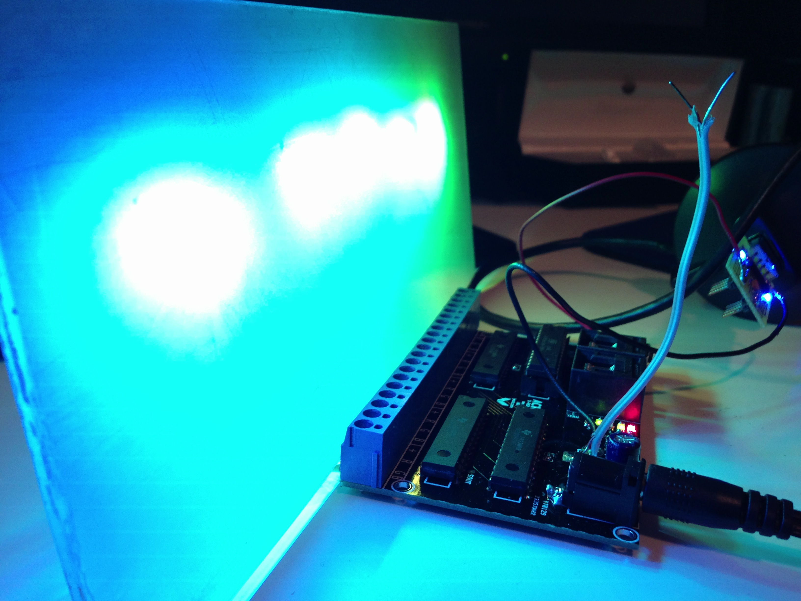

* [Git Repo](/git/acris)

[[toc]]

ACRIS is an end-to-end system that provides the capability to control
individually addressable RGB LED light fixtures.

The ACRIS project includes:

* schematics and layout for a light fixture board, capable of driving up to 5
  RGB LEDs,
* schematics and layout for serial- and USB-to-RS485 communications boards,
* bootloader and application firmware for the AVR microcontroller on the board,
* a software application for reprogramming the lights, and
* an extensible software framework, server, and client application for
  controlling various types of lights

## Boards

The principle board, _ledctrlr_, can drive up to 5 RGB LEDs and communicates to
the host via an RS-485 network.

The project also includes boards for [other
purposes](https://github.com/jwcxz/ACRIS/tree/master/boards/prj), such as
providing a USB serial interface to an RS-485 network.

## Light Fixtures

The ledctrlr board aims to be compact yet versatile.  In one embodiment, it was
installed into an inexpensive consumer wall sconce purchased at a hardware
store.  The existing incandescent fixture was removed, the board was installed
into the back of the unit, and RGB LEDs were mounted onto a simple piece of
sheet metal.  The sconce's diffuser provides a pleasant smoothing of the
resulting light output.

Other fixtures can easily be prototyped, such as a retrofitting of an IKEA light:

Or even a sanded-and-etched piece of acrylic:

## Firmware

ACRIS uses the Atmel AVR microcontroller in its boards.  Each board is
individually addressable; its address can be set when in bootloader mode,
whereby it is stored to EEPROM.

### Bootloader

The
[bootloader](https://github.com/jwcxz/ACRIS/tree/master/avr/prj/bootloader_uart)
provides functionality for a host to set board address and to write a new
application to application memory.  The bootloader software can perform
operations on some or all devices within the network.

### Application

The [main
application](https://github.com/jwcxz/ACRIS/tree/master/avr/prj/ledctrlr_uart)
listens for lighting control packets sent to the device's address and controls
the LED drivers accordingly.  A simple protocol allows for both 8- and 12-bit
resolution of the desired values.

## Software

ACRIS's software tools (written in Python) aim to provide a high-level
interface for interaction with any network of light fixtures.

### Bootloader Controller

A simple [Python script]() provides functionality for addressing and
programming boards.

### ACRIS Framework, Server, and Client

An [extensible framework](https://github.com/jwcxz/ACRIS/tree/master/sw/acris)
provides facility for introducing new light fixture types and interacting with
them.  Display patterns for light fixtures can be assembled into environmental
plugins, which are in turn controllable from a server-client architecture.
Multiple plugins can be active (so long as they do not address the same light
instrument), allowing for a high degree of environmental configurability.

The server is responsible for continuous playback to the light fixtures and can
be controlled via a simple socket connection from a
[client](https://github.com/jwcxz/ACRIS/tree/master/sw/acris/interface).

## Future Work

The NRF24L01+ wireless chip can be used to establish a simple wireless network
of ACRIS boards.  Current top-of-tree focuses on shifting from RS-485 to this
wireless technology.

Shift to an ARM-based MCU with more resources would enable transition to other
wireless network architectures.
