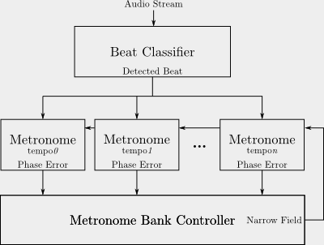
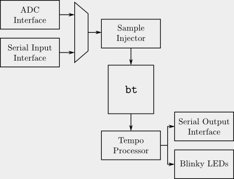

* [Git Repo](/git/bt)

bt is a naive hardware tempo estimator.  As shown in the algorithm
architecture below, it instantiates large number of metronomes, each of which
continuously attempts to resynchronize to peaks detected in an incoming audio
stream.  Each metronome is scored based on the effort required to synchronize
it to a peak, averaged over time.  Metronomes closer to the true tempo of the
incoming stream require less effort (over time) to remain synchronized to
detected peaks.

bt was built as a class project ([MIT 6.375](http://csg.csail.mit.edu/6.375)).
The class focused on construction of hardware through high-level behavioral
definition with [Bluespec](http://bluespec.com/).  As such, the vast majority
of the implementation was written in Bluespec, except for the low-level
interfacing models for ingesting an audio stream and outputting serial data.

The [project proposal](proposal.pdf) submitted for the class provides an
informal overview of the project.

bt was implemented on a [Spartan-3AN Starter
Kit](https://www.xilinx.com/support/documentation-navigation/boards-and-kits/spartan-3/hw-spar3an-sk-uni-g.html),
with the addition of a small biasing circuit to correct the input range of the
audio signal.

