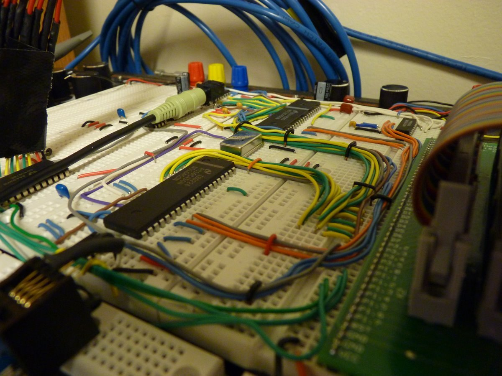
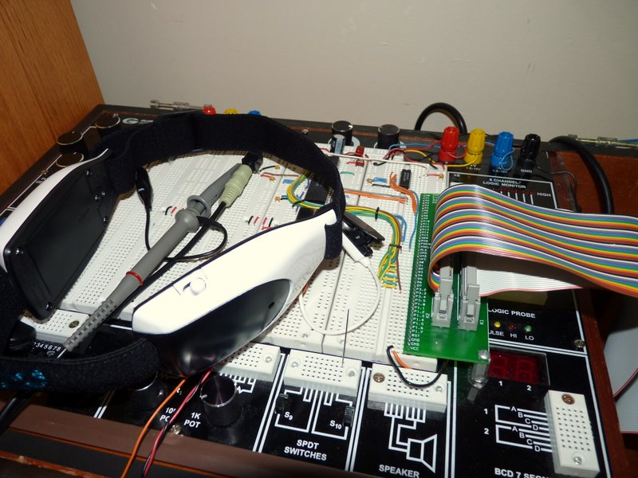
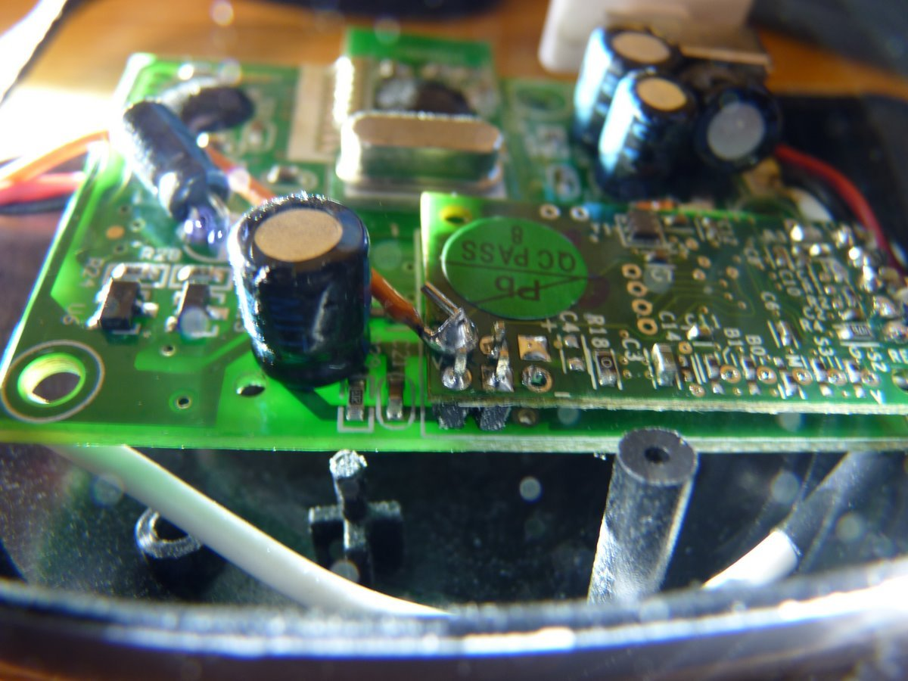
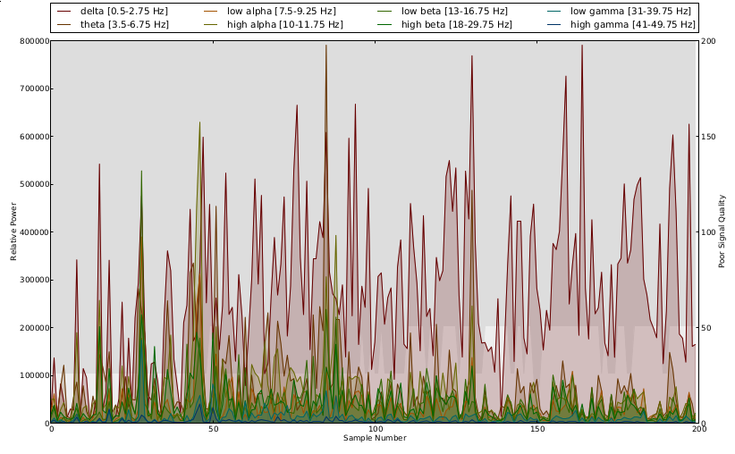
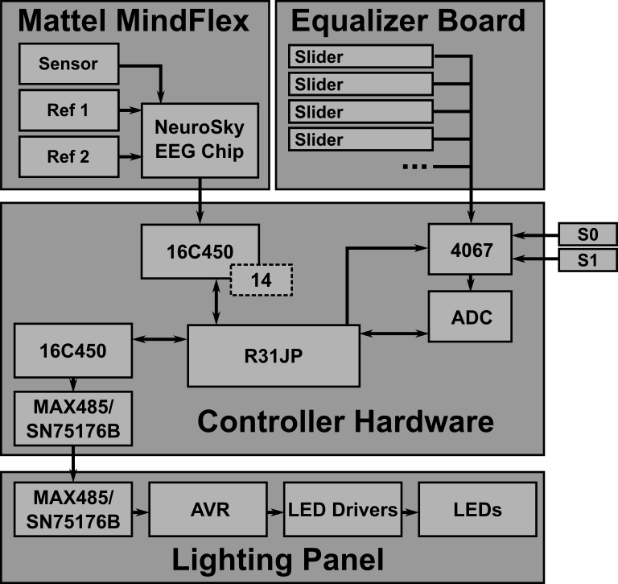
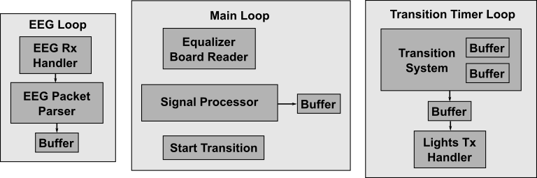

* [Git Repo](/git/cerebro)
* [Project Whitepaper](https://github.com/jwcxz/CEREBRO/raw/master/report/report.pdf)

CEREBRO is a system that provides rudimentary translation of signals captured
from a consumer EEG device into a lighting display output.  As my final project
for [6.115](http://web.mit.edu/6.115/www/) (MIT's "microcomputer" class), this
project required use of an 8051-based class labkit, with code written in
assembly.

## EEG

EEG sensor data was obtained by modifying the headband of a [Mattel Mindflex
toy](https://en.wikipedia.org/wiki/Mindflex) to output data from the [NeuroSky
TGAM1 module](http://neurosky.com/biosensors/eeg-sensor/) within it.

## Driving the Display

CEREBRO's 8051 is responsible for computing a lighting display pattern in
realtime and driving a light fixture similar in design to that of
[ACRIS](/projects/acris).

A few simple signal processing algorithms were built to showcase CEREBRO.  An
analog equalizer board could be used to adjust the algorithm behavior.

## Design Considerations

As a large assembly project, elegant infrastructure and coding practices were
critical to successful implementation and testing.  I established a number of
conventions that allowed for modularization of the code.  Careful documentation
of interface definition and accounting of register usage were crucial.
CEREBRO's modules enabled a variety of functionality, such as:

* a math library for converting HSV space into RGB,
* 3 signal processing algorithms for turning an EEG stream into a lighting
  pattern,
* a routine for cross-fading between color values,
* a state machine for receiving and decoding EEG data from the NeuroSky sensor,
* a driver for smoothly displaying the computed lighting pattern on the light
  fixture
* a workloop for retrieving analog slider values from a multiplexed equalizer
  board, and
* a simple serial console for printing of debug output

