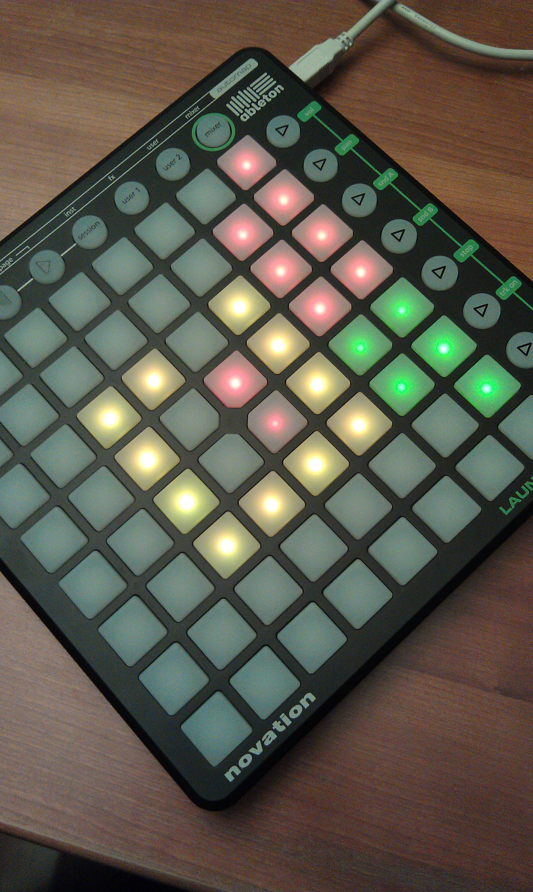
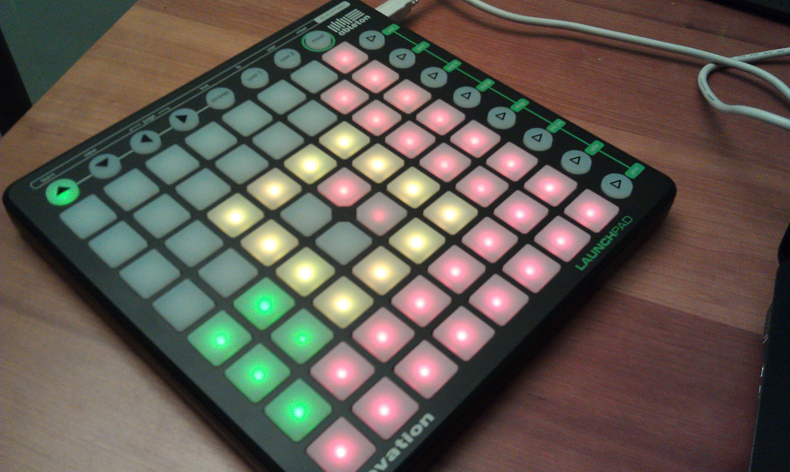
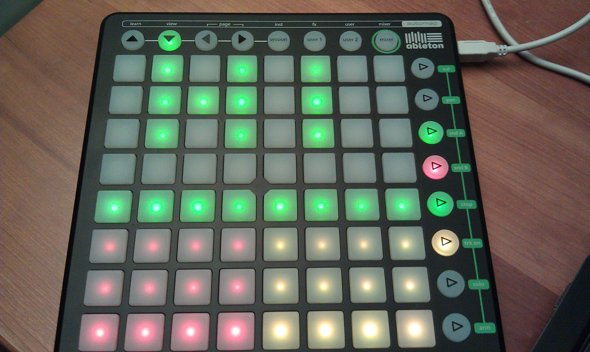

* [Git Repo](/git/lpctrl)

lpctrl is a simple software framework and toolkit for controlling the [Novation
Launchpad](http://novationmusic.com/products/midi_controller/launchpad) MIDI
controller.

The framework contains a server that controls the Launchpad.  The server
provides an on-device utility allowing the user to select between various
plugins, which extend the framework.

The plugin API provides functionality for plugins to receive input and draw to
the controller.

